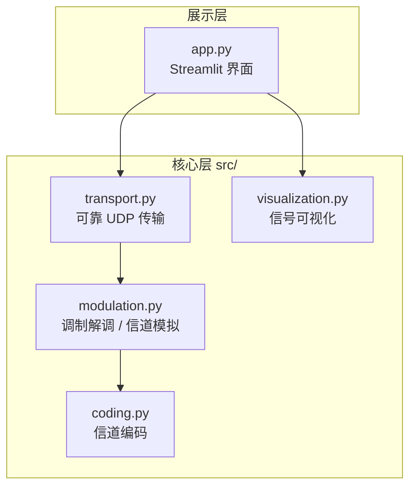

# 可靠 UDP 文件传输与调制解调系统


基于 [Streamlit](https://streamlit.io/) 的交互式通信系统，实现了基于 UDP 的可靠文件传输、数字调制解调（BPSK/QPSK）、信道编码（重复编码 / 汉明编码）与误码率（BER）分析。

## 功能特性

- **调制解调**：BPSK / QPSK 调制与解调
- **信道编码**：重复编码 (1,3)、汉明编码 (7,4，支持单比特纠错)
- **可靠 UDP 传输**：数据分块、滑动窗口、超时重传、ACK 确认，在不可靠 UDP 之上实现可靠传输
- **误码率分析**：模拟信道与实际传输的误码率对比、比特错误定位
- **信号可视化**：星座图、频谱分析、时频瀑布图、时域波形对比
- **中文界面**：发送文件 / 接收文件 / 误码率分析 三个页签

## 系统架构

项目采用分层架构，核心逻辑与界面层分离，核心算法独立可测：



- **`app.py`**：Streamlit 界面层，只负责交互与展示。
- **`src/transport.py`**：可靠 UDP 传输，通过回调接口与上层解耦。
- **`src/modulation.py`**：调制解调、加噪、误码率、信道模拟（纯逻辑）。
- **`src/coding.py`**：重复编码与汉明编码（纯函数）。
- **`src/visualization.py`**：matplotlib 绘图。

## 项目结构

```
.
├── app.py                    # Streamlit 入口（界面层）
├── src/                      # 核心库
│   ├── coding.py             #   信道编码
│   ├── modulation.py         #   调制解调与信道模拟
│   ├── transport.py          #   可靠 UDP 传输
│   └── visualization.py      #   信号可视化
├── tests/                    # 单元测试
├── .github/workflows/ci.yml  # GitHub Actions CI
├── pyproject.toml            # ruff / mypy / pytest 配置
├── requirements.txt          # 运行时依赖
├── requirements-dev.txt      # 开发依赖
└── README.md
```

## 环境要求

- Python 3.8+

## 安装

```bash
# 安装运行时依赖
pip install -r requirements.txt

# 安装开发依赖（测试与代码检查）
pip install -r requirements-dev.txt
```

## 使用方法

```bash
streamlit run app.py
```

1. **发送文件**：设置目标 IP 与端口，选择文件并发送
2. **接收文件**：在接收端监听对应端口
3. **误码率分析**：调整调制方式、编码方案与信噪比，观察误码率与信号波形

## 测试与代码质量

```bash
# 运行单元测试并生成覆盖率报告
pytest --cov=src --cov-report=term-missing

# 静态检查（lint）
ruff check .

# 类型检查
mypy src
```

核心算法（编码 94%、调制解调 95%）已覆盖单元测试；CI 会在每次 push / PR 时自动运行上述全部检查。

## 主要模块

- `ModemSystem`：调制解调与信道模拟核心
- `ReliableUDPTransfer`：基于 UDP 的可靠传输（滑动窗口 + 重传）
